# Enterprise Apps Walid Oumass - Zwanze 1070

## Projectbeschrijving

Zwanze 1070 is een prototype van een website voor een fictieve Anderlechtse NGO. De organisatie brengt buurtbewoners, vrijwilligers en lokale partners samen via activiteiten, hulpacties en ontmoetingsmomenten.

De website werd gemaakt als Java Spring Boot project voor het vak Enterprise Applications. Bezoekers kunnen recente evenementen bekijken, de details van een evenement openen, een nieuw evenement toevoegen, algemene informatie over de organisatie lezen en contact opnemen via een contactformulier.

Repository: https://github.com/Walid-Oum/enterprise-apps-Walid-Oumass

## Functionaliteiten

De applicatie bevat:

* Een homepage met de 10 laatste evenementen.
* Een detailpagina per evenement.
* Een formulier om een nieuw evenement toe te voegen.
* Validatie op verplichte velden en e-mailadres.
* Een about-pagina met informatie over de NGO.
* Een contactformulier dat berichten via Mailtrap verstuurt.
* Seed data voor locaties en evenementen.
* Herbruikbare navigatie en footer via Thymeleaf fragments.
* Responsive layout met hamburger menu op mobiele schermen.

## Gebruikte technologieën

* Java
* Spring Boot
* Spring Web
* Thymeleaf
* Spring Data JPA
* H2 Database
* Jakarta Validation
* Java Mail Sender
* Maven
* Tailwind CSS
* Mailtrap
* Figma
* Git en GitHub

## Technische implementatie

| Functionaliteit                  | Bestand(en)                                                |
| -------------------------------- | ---------------------------------------------------------- |
| Homepage met laatste evenementen | `PageController`, `EventRepository`, `index.html`          |
| Event details                    | `EventController`, `event-details.html`                    |
| Nieuw evenement toevoegen        | `EventController`, `new-event.html`                        |
| Validatie                        | `Event.java`, `Location.java`, `new-event.html`            |
| About-pagina                     | `PageController`, `about.html`                             |
| Contactformulier en Mailtrap     | `PageController`, `contact.html`, `application.properties` |
| Database entities                | `Event.java`, `Location.java`                              |
| Repositories                     | `EventRepository.java`, `LocationRepository.java`          |
| Seed data                        | `DataSeeder.java`                                          |
| Navigatie en footer              | `fragments.html`                                           |
| Responsive design                | Tailwind CSS classes in de HTML templates                  |

## Installatiehandleiding

Clone de repository:

```bash
git clone https://github.com/Walid-Oum/enterprise-apps-Walid-Oumass.git
```

Ga naar de projectmap:

```bash
cd enterprise-apps-Walid-Oumass
```

Open het project in IntelliJ IDEA.

Start de applicatie via de main class:

```text
Zwanze1070Application
```

Open daarna de website in de browser:

```text
http://localhost:8080
```

## H2 database

De applicatie gebruikt een H2 in-memory database. De database wordt automatisch gevuld met testdata wanneer de applicatie start.

De H2 console is bereikbaar via:

```text
http://localhost:8080/h2-console
```

Gebruik deze gegevens:

```text
JDBC URL: jdbc:h2:mem:zwanze1070
Username: sa
Password:
```

Het wachtwoord blijft leeg.

## Mailtrap setup

Voor het contactformulier wordt Mailtrap gebruikt om e-mails veilig te testen.

De echte Mailtrap credentials staan niet in de repository. Lokaal moeten deze environment variables ingesteld worden:

```text
MAILTRAP_USERNAME=your_mailtrap_username
MAILTRAP_PASSWORD=your_mailtrap_password
```

In `application.properties` worden deze variabelen gebruikt:

```properties
spring.mail.username=${MAILTRAP_USERNAME}
spring.mail.password=${MAILTRAP_PASSWORD}
```

Zo blijven de echte credentials buiten GitHub.

## Screenshots

De screenshots staan in:

```text
docs/screenshots
```

### Desktop

#### Homepage

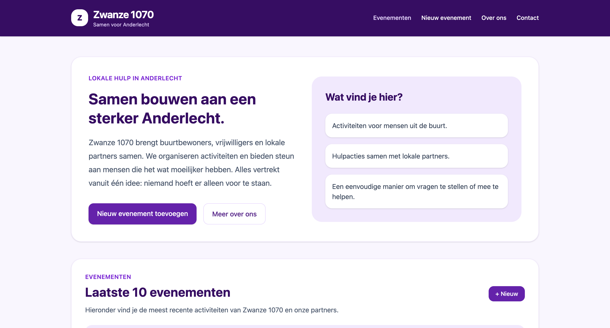

#### Eventenlijst

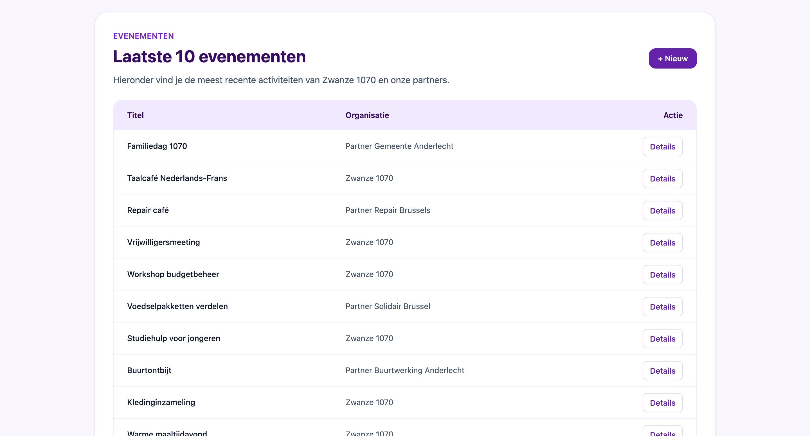

#### Event details

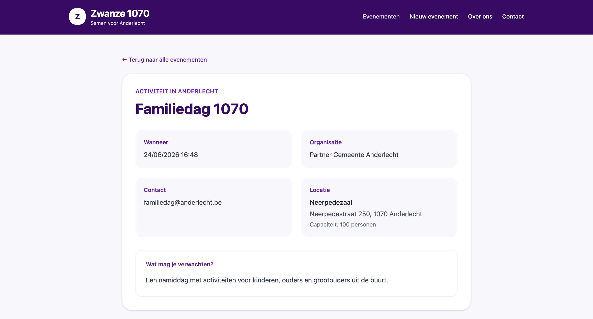

#### Nieuw evenement

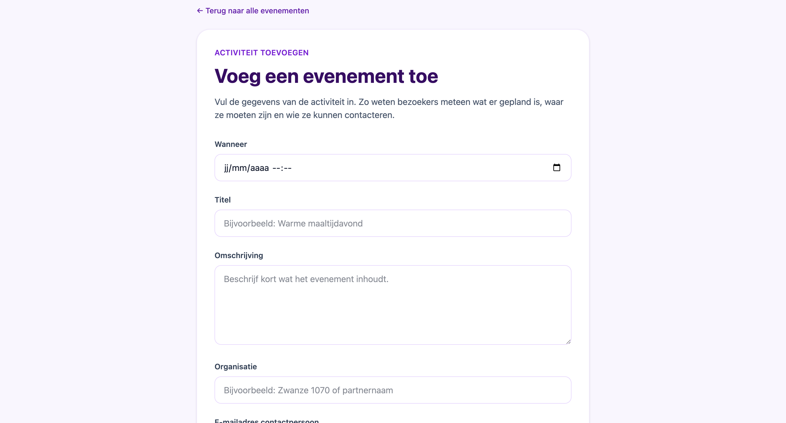

#### About

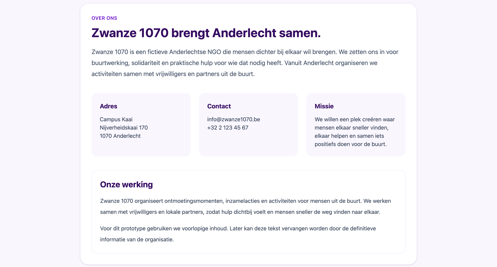

#### Contact

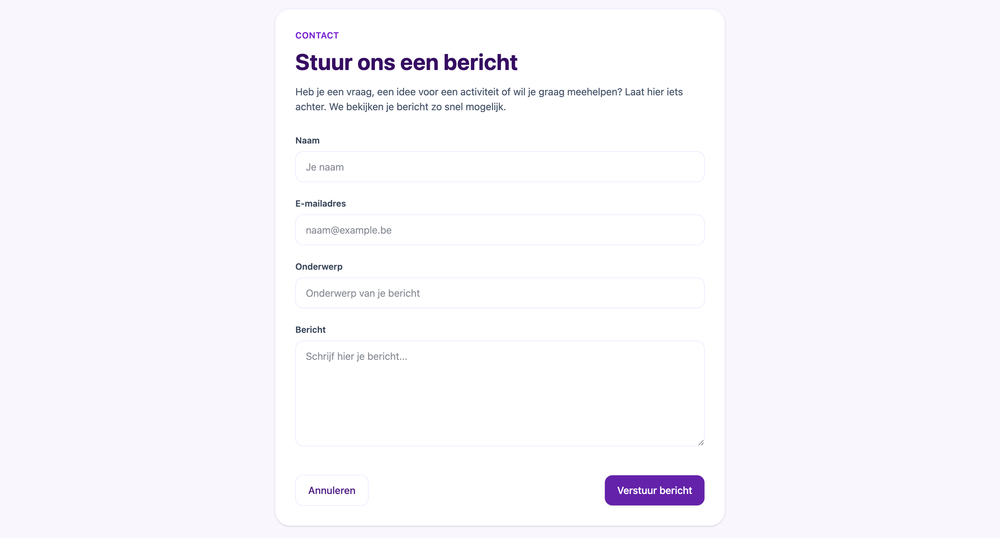

### Mobile

#### Mobiele homepage

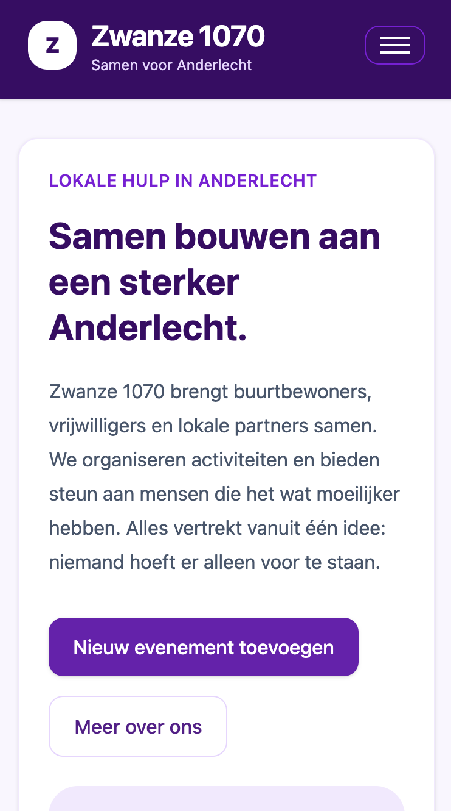

#### Mobiel menu

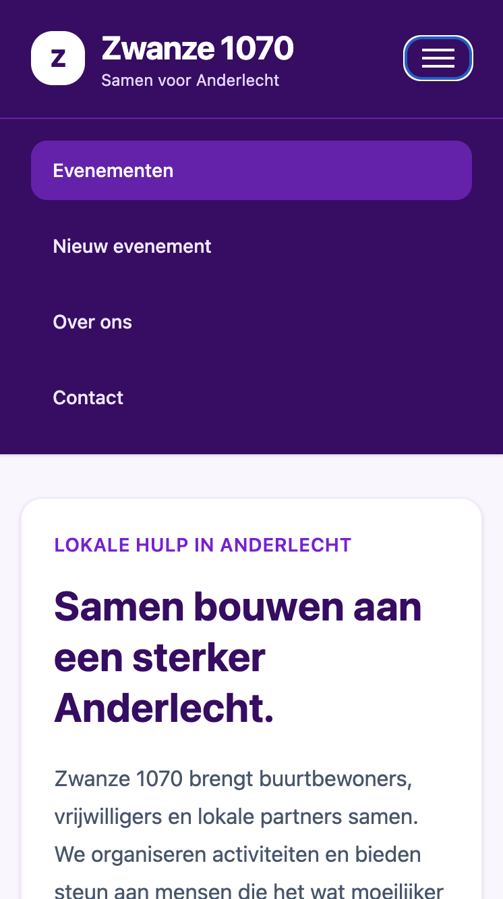

#### Mobiele eventenlijst

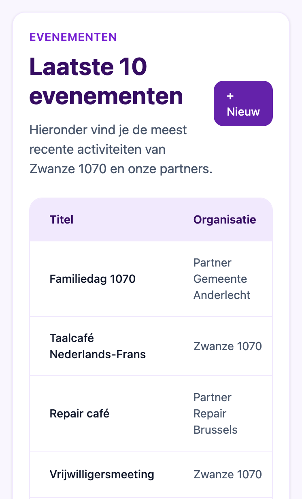

#### Mobiel nieuw evenement

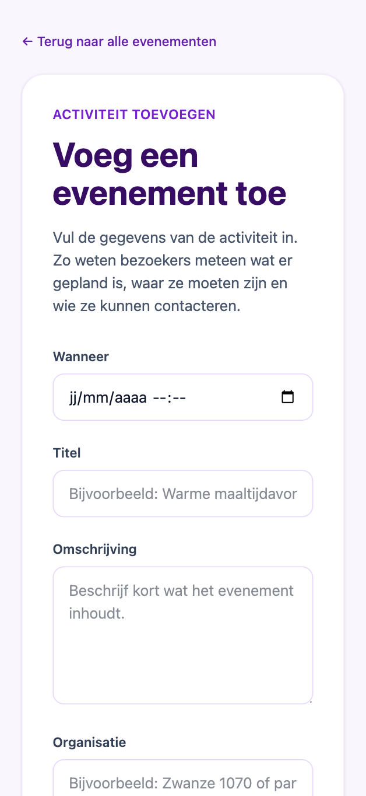

#### Mobiele contactpagina

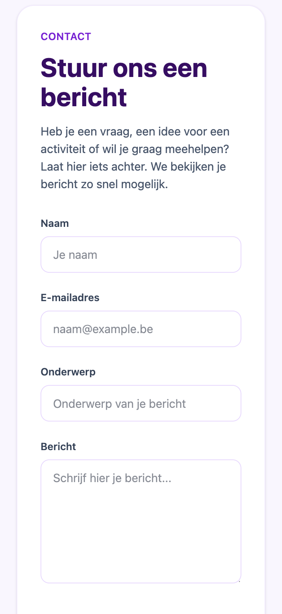

## Gebruikte bronnen en tools

Voor dit project werden de volgende bronnen en tools gebruikt:

* Lesmateriaal van het vak Enterprise Applications.
* Spring.io documentatie en guides, voor Spring Boot, MVC, controllers, JPA en validatie.
* Thymeleaf documentatie, voor templates, fragments en form binding.
* Mailtrap documentatie, voor SMTP setup en het testen van e-mails.
* Tailwind CSS documentatie, voor styling en responsive layout.
* Figma, gebruikt om na te denken over de eerste layout en designrichting.
* ChatGPT, gebruikt als leer- en ondersteuningshulpmiddel.

## Gebruik van AI

Tijdens dit project heb ik ChatGPT gebruikt als leer- en ondersteuningshulpmiddel.

Voor de start van de implementatie gebruikte ik AI om Spring Boot en Thymeleaf concepten beter te begrijpen, omdat deze technologieën nieuw voor mij waren.

Tijdens de ontwikkeling gebruikte ik AI ook voor ondersteuning bij de Mailtrap setup, het begrijpen van foutmeldingen en het nadenken over designkeuzes zoals layout, navigatie, fragments en responsive gedrag.

De code werd door mij geïmplementeerd, aangepast en getest. AI werd gebruikt als begeleiding om concepten beter te begrijpen, problemen op te lossen en de structuur en vormgeving van het project te verbeteren.

## Auteur

Naam: Walid Oumass
Project: Enterprise Applications
Website: Zwanze 1070
Repository: https://github.com/Walid-Oum/enterprise-apps-Walid-Oumass
